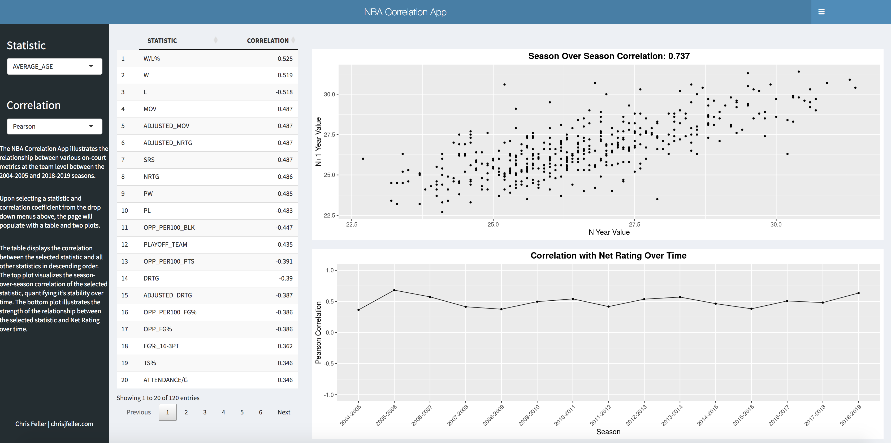

# NBA Correlation App

### Overview
Motivated by @Cardanski0's NFL Year-Over-Year Correlation tool, in which users can visualize the relationship between NFL metrics, I attempted to follow a similar approach at the team level for the NBA. The following example illustrates the relationship that the average age of a team has with other on-court metrics. The app can be found [here](https://chrisfeller.shinyapps.io/correlation_app/).

